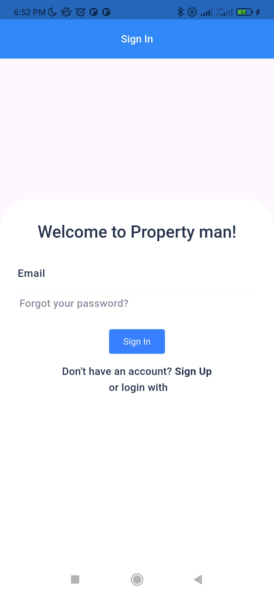
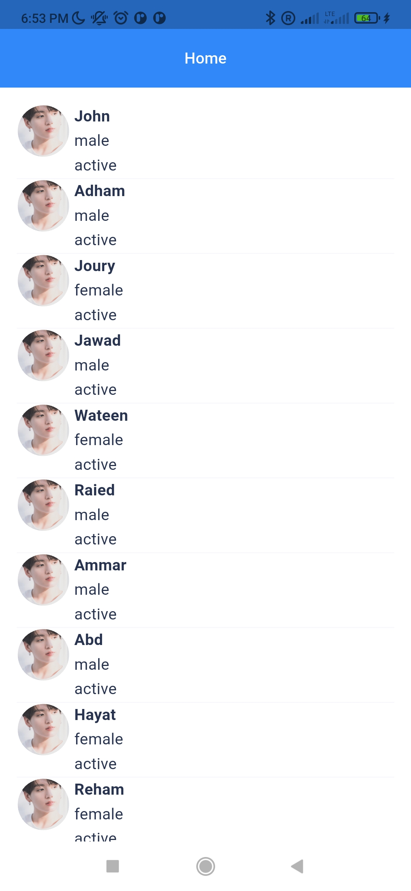
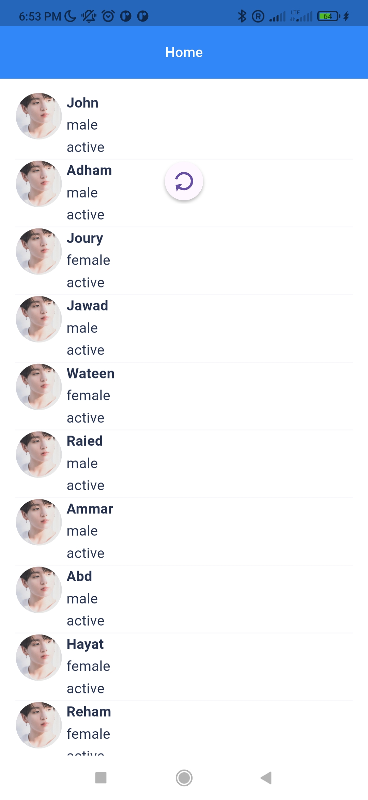
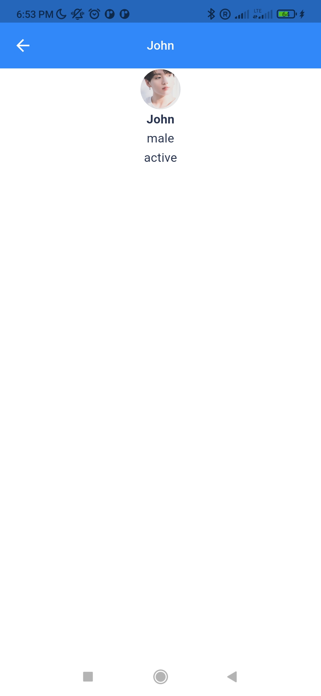

# User List

# Integration Guide: User List

## Table of Contents

1. [Introduction]
2. [Prerequisites]
3. [Setup Instructions]
    1. [Step 1: Setup the environment]
    2. [Step 2: Configure the Integration]
    3. [Step 3: Test the Integration]
4. [Features]
5. [Enhancements]
6. [Demo]
7. [Authentication]
8. [API Reference]
9. [Common Errors & Troubleshooting]
10. [FAQs]
11. [Support]

---

## Introduction

This guide provides step-by-step instructions for integrating [User List] into your project.
Follow the instructions to quickly get started and connect your system with [User List].

---

## Prerequisites

Before you begin the integration process, make sure you have the following:

- Nothing if you keep the faked data
- Other than that you need to implement the backend service.

## Setup Instructions

    - Use Visual studio code and any preferable IDE
    - Flutter (Channel stable, 3.27.3)
    - Android Studio (version 2024.2)
    - Android devices (Android SDK version 35.0.0)

### Step 1: Install Dependencies

Start by installing the required dependencies to your project.
    - Flutter pub get

### Step 2: Configure the Integration

    You can use the fixed data in the application or create api service to match the solution.
    Within class Env you have a useFakeData property.

    To use mocked data set useFakeData = true as it is by default.
        static final EnvData dev = EnvData(
            debug: true,
            debugShowCheckedModeBanner: false,
            debugShowMaterialGrid: false,
            debugApiClient: true,
            apiBaseUrl: ApiConfiguration.baseUrl,
            useFakeData: true,
        );

### Step 3: Test the Integration

   Just run Run the application on your device or browser.

## Features

    01-Signin implemented with Blocs and Provider
    02-Refresh token within Splash screen
    03-User list with pagination
    04-Details screen for user

## Enhancements
  
    01-update Signin with Riverpod

## Demo

### Screenshots

- **Dashboard View**

| |  |
|-----------------|-----------------|

| |  |
|-----------------|-----------------|

## Authorization

No authorization is required here

## Api reference

You have to create your own api or use faked data

## Common Errors & Troubleshooting

<https://github.com/adhamkhwaldeh/UserListPaging-/issues>

## FAQs

<https://github.com/adhamkhwaldeh/UserListPaging-/issues>

## Support

<https://github.com/adhamkhwaldeh/UserListPaging->
